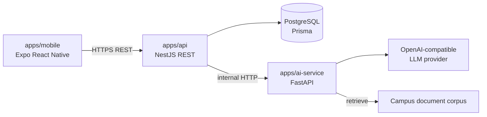

# CampusMind AI — Architecture

## Context

CampusMind AI helps students and campus users get answers to university-related questions through a mobile chat experience. Answers are grounded with retrieval-augmented generation (RAG) over campus-related information.

## Service responsibilities

| Service | Path | Owns | Does not own |
|---------|------|------|----------------|
| Mobile client | `apps/mobile` | UI, local client state, calling the Nest API | Direct DB access, direct LLM calls |
| Core API | `apps/api` | Users (future auth), conversations, messages, orchestration | Embedding/index internals, LLM prompt details |
| AI service | `apps/ai-service` | RAG retrieval, LLM calls via provider-agnostic interface | Long-term chat persistence, auth |
| Database | PostgreSQL via Prisma in `apps/api` | Relational data for the product | Vector index details (may live in AI service or pgvector later) |

## Target request flow — send chat message (Phase 2+)

Phase 0/1 do not implement this flow. It is documented so later work stays aligned.

1. Mobile sends `POST` chat message to NestJS (`apps/api`).
2. NestJS authenticates the user (future phase), loads or creates a conversation, and persists the user message.
3. NestJS calls the AI service with the question and any needed context.
4. AI service retrieves relevant campus chunks (RAG), calls an OpenAI-compatible LLM, and returns an answer plus citations.
5. NestJS persists the assistant message (and citation metadata) and returns the response to mobile.

## Data ownership

- **NestJS + Prisma** are the system of record for `User`, `Conversation`, and `Message`.
- **AI service** owns retrieval/indexing behavior and LLM prompting.
- **Mobile** never talks to Postgres or the LLM provider directly.

## Environment and configuration

Shared variable names are defined in [environment.md](environment.md) and `.env.example`. Secrets stay in local `.env` (gitignored). LLM access uses provider-agnostic names such as `LLM_API_KEY` and `LLM_BASE_URL`.

## v1 non-goals

- Classical ML prediction APIs
- Premature split into many microservices beyond the Nest + FastAPI boundary
- Authentication endpoints in Phase 1 (Prisma `User` may exist for future auth)
- Committing raw private datasets or real API keys

## Evolution

| Phase | Focus |
|-------|--------|
| 0 | Docs, layout, env hygiene |
| 1A | Local PostgreSQL via Docker Compose (current infra slice) |
| 1B+ | NestJS / Prisma / FastAPI / Expo scaffolds + health checks |
| 2+ | RAG/LLM chat, fuller Docker, CI/CD, tests and security |

## Related docs

- [ADR 0001 — Stack choices](adr/0001-stack-choices.md)
- [Environment variables](environment.md)
